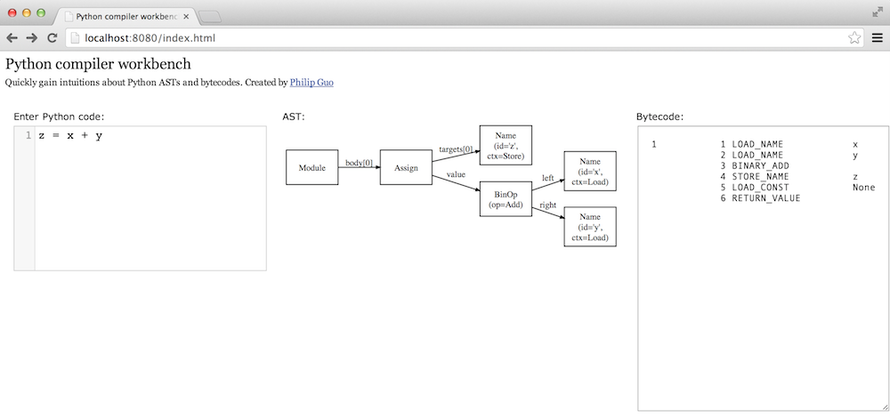

Python Compiler Workbench
=========================

This is a live coding environment to help you develop intuitions about how
Python source code compiles to ASTs and bytecodes. As you type in code,
it gets compiled to AST and bytecode formats, and the visualization updates
instantaneously.

Watch the [1.5-minute YouTube demo](https://www.youtube.com/watch?v=fMCV3KNYquo).

## Installing

1. [Download GraphViz](http://www.graphviz.org/Download..php) and install it.
2. Install two Python packages: `bottle` and `pydot`.

One way to install is:

    easy_install pip
    pip install bottle
    pip install pydot

## Running

1. Run `python backend.py` to start the server.
2. Visit http://localhost:8080/index.html

(tested with Python 2.7 on Mac OS X so far)

## Why did I create this project?

Because it was the fastest and most effective way for me to learn about Python ASTs.

The [official docs](http://docs.python.org/2/library/ast.html#abstract-grammar) aren't that
helpful for gaining intuitions about what real ASTs look like. They are more of a reference guide,
not a tutorial. So I figured that the best tutorial would be to create an environment where
I could easily enter in any piece of Python code and see what it compiled into.

For instance, I wanted to see what a chain of `if-elif-else` blocks looked like in the AST,
so I just typed in a simple example:

Low and behold, it compiles into a series of nested `if-else` blocks!

On a meta level, the process of *building* this tool itself -- especially writing the code
to transform ASTs into the GraphViz format for visualization -- gave me even better intuitions
for how AST nodes are structured.

So all in all, it's been a very efficient and fun way for me to learn :) And if this project
helps you learn as well, then even better!

